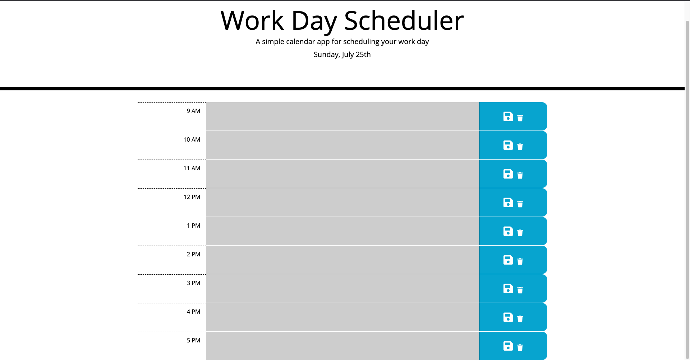

# Workday-Scheduler

### This Web Application is a Hourly Task scheduler build on Moment.js, Bootstrap, and JQuery. 

The user can save and delete hourly events. The scheduler handles events for a single work day (9am - 5pm) at a time. 

You can access the Web App here: [Workday Scheduler Web App](https://github.com/saumilkt/Workday-Scheduler)